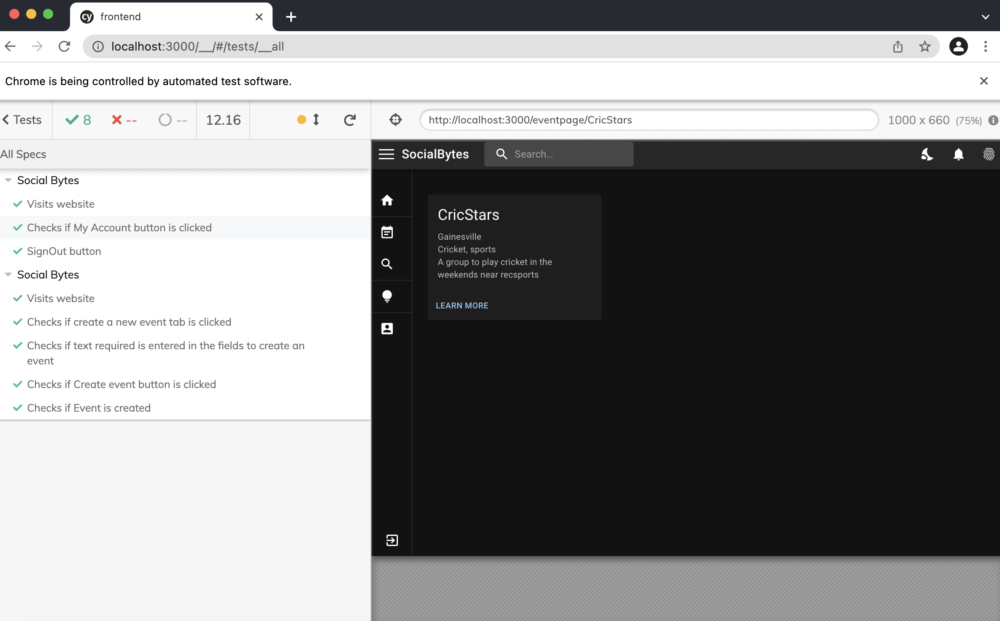
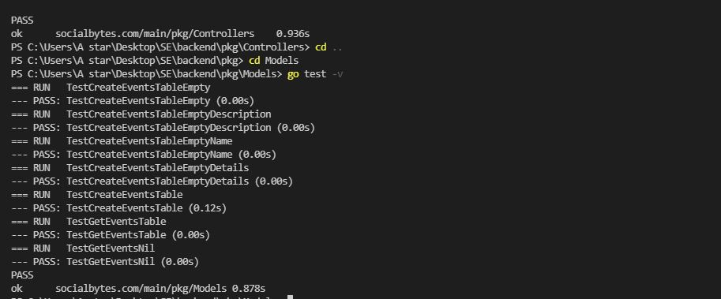
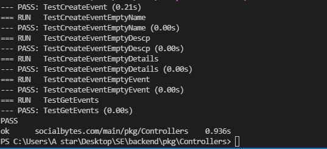
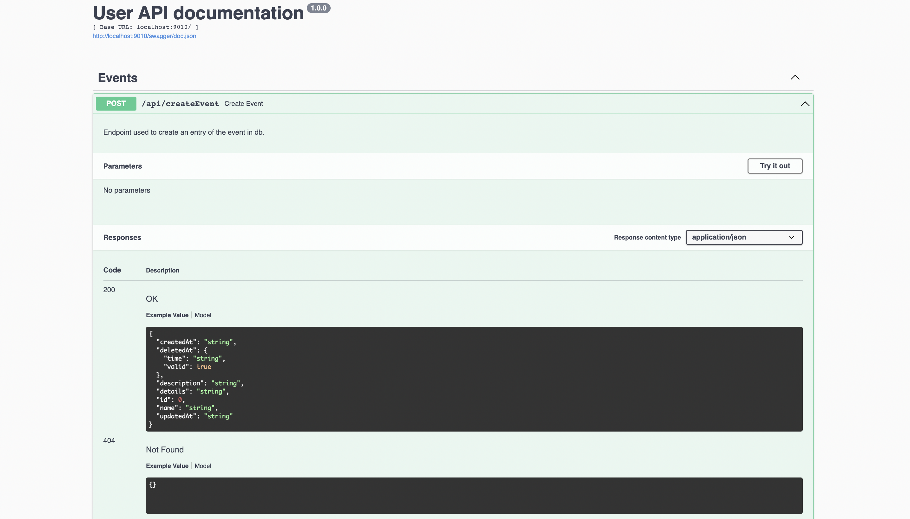
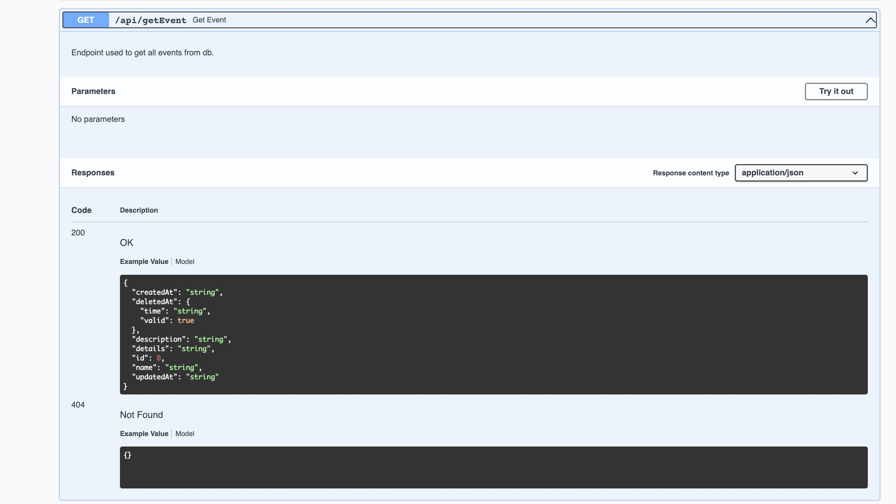

## Sprint 3 status

### React JS UI Progress
- Updated the create event page to support fields such as Description, Location, Image, Interests, Date along with event name.
- Location search uses google api to fetch real locations and to display the location with marker in the individual event page.
- Created event page to show individual event page with details and display image and locations by picking it dynamically based on ID.
- Implemented search page to display all the events being hosted and then option to search the events which is integrated with the backend.
- Modified the event card page to adjust the image, title and description details.

### Go-Lang backend progress
- Added swagger API documentation for User Profile.
- Implemented error handling for User API endpoints.
- Created APIs to add user profile into the database.
- Updated event tests to test the APIs that read, create, delete, edit events as per new structure.
- Covered all the cases to test valid and invalid cases.

## Screenshots for unit tests

#### UI Components tests

#### Go lang unit tests

## Screenshots for API endpoints
#### Swagger documentation for createEvent endpoint

#### Swagger documentation for getEvent endpoint

## Project Demo Link
https://youtu.be/opOkQX1owYI

## Project Testing Link
https://youtu.be/Uxim8QTjCK4

