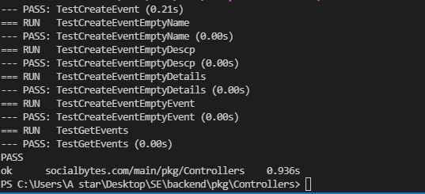

## Sprint 2 status

### React JS UI Progress
- Made connection of create-event page to pass on the information to backend, which would be processed and stored in the database.
- Added event is shown in the webpage.
- Additional search functionality can be used to filter the added events.
- Updated home page with material UI designed card to provide details about the website to the users.
- Added Jest unit testcases for UI
- Uing Cypress framework added frontend unit test cases.

### Go-Lang backend progress
- Added swagger API documentation.
- Implemented error handling for API endpoints.
- Using Go lang testing package, written Unit tests- testify.
- Created APIs to add event into the database.
- Created APIs to test the APIs that read, create, delete, edit events.
- Covered all the cases to test valid and invalid cases.

## Screenshots for unit tests

#### UI Components tests

#### Go lang unit tests

